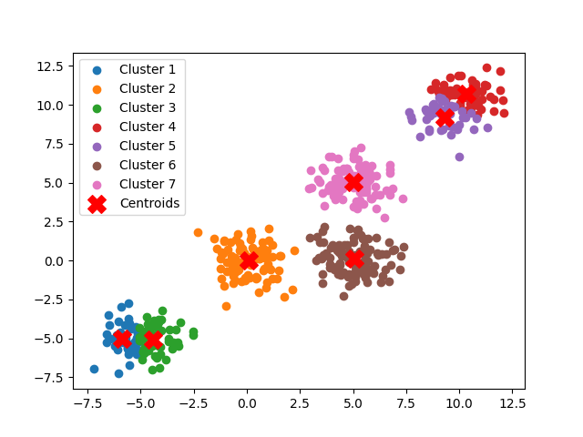

<h1>K-Means Clustering from Scratch</h1>

This project provides an implementation of the K-Means clustering algorithm in Python, developed without using any machine learning libraries like sklearn. It is intended as a learning project to explore how the K-Means algorithm operates at a low level, using only numpy for numerical operations and matplotlib for visualization.
  
<h3>Features</h3>  

  <b>1.Pure K-Means Implementation:</b> The clustering algorithm is implemented from scratch without relying on sklearn. 
  
  <b>2.Dynamic Dataset:</b> Currently, the project uses a self-created dataset, but it can be easily replaced with any other dataset in numpy array format.
  
  <b>3.Automatic K Selection:</b> Includes a function to help identify an optimal value of k, the number of clusters, using an elbow plot for visualization and better user convenience. 

<b>Requirements</b>

    Python 3.11.4
    Numpy: For handling numerical operations.
    Matplotlib: For visualizing the data and elbow plot.

<h1> Getting Started </h1>

<h2>Installation</h2>

Install the required libraries by running:

    pip install numpy matplotlib

<h2>Usage</h2>

Clone the repository: Clone this project to your local machine.

    git clone https://github.com/yourusername/kmeans-from-scratch.git

Run the Script: Execute the Python script to see the clustering in action.

    python kmeans_scratch.py

<h2>Replace Dataset</h2> If you'd like to use a different dataset, replace the current numpy array with your own data, formatted as a numpy array where rows are samples and columns are features.

  
The project generates two primary outputs:

    Clustered Data Plot: Displays the dataset divided into k clusters, each represented by a unique color. 
    Elbow Plot: Shows the variance for different values of k to help select an optimal number of clusters.

<h2>Example Output</h2>

<h2>Algorithm Overview</h2>

K-Means Clustering

The K-Means algorithm iteratively divides data into k clusters by:

    Initializing k random centroids.
    Assigning each data point to the closest centroid.
    Recalculating centroids based on the mean of assigned points.
    Repeating until convergence or reaching a maximum number of iterations.

Finding Optimal k Value (Elbow Method)

This implementation includes an elbow plot to help you find the optimal value for k. As k increases, the within-cluster variance decreases. The elbow point on the plot indicates a suitable value for k.
Example Code Snippet

# Import necessary libraries
    import numpy as np
    import matplotlib.pyplot as plt
    
    # Initialize k-means parameters
    # ...
    
    # Run K-means clustering
    # ...

Future Improvements

    Add support for different distance metrics.
    Implement K-Means++ for improved centroid initialization.
    Add silhouette score calculation for better cluster quality analysis.

Contributing

Feel free to open issues or pull requests for improvements or bug fixes. Contributions are always welcome!
Contact

For any suggestions or improvements, please reach out!

